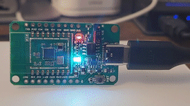

# PineCone Rust Blinky
A simple example program using the [BL602 Rust HAL](https://github.com/sipeed/bl602-hal) and [PineCone](https://wiki.pine64.org/wiki/PineCone) BL602 evaluation board.

## Installation
If you don't have Rust and Cargo installed, install the stable toolchain using rustup from https://rustup.rs/ 

This project was tested with following setup:
```
rustup install nightly-2022-12-25
rustup component add llvm-tools-preview --toolchain nightly-2022-12-25
rustup target add riscv32imac-unknown-none-elf

cargo install cargo-binutils
```
One of the official [Bouffallo Lab](https://en.bouffalolab.com/) flash tools is used:

```
pip install bflb-mcu-tool
```

You can generate firmware:

```
cargo objcopy --release -- -O binary pinecone-blinky.bin
```

Flash it to PineCone board (Set the PineCone jumper (IO 8) to the L position and press the reset button):

```
bflb-mcu-tool --chipname bl602 --firmware pinecone-blinky.bin
```

Alternatively you can use [cargo-blflash](https://github.com/spacemeowx2/blflash) for flashing:

```
cargo install cargo-blflash

cargo blflash --release --initial-baud-rate 115200 --baud-rate 115200 --port /dev/cu.usbserial-14160
    Finished release [optimized + debuginfo] target(s) in 0.06s
[TRACE blflash] Detect ELF
[INFO  blflash::flasher] Start connection...
[TRACE blflash::flasher] 5ms send count 55
[TRACE blflash::flasher] handshake sent elapsed 50.182µs
[INFO  blflash::flasher] Connection Succeed
[INFO  blflash] Bootrom version: 1
[TRACE blflash] Boot info: BootInfo { len: 14, bootrom_version: 1, otp_info: [0, 0, 0, 0, 3, 0, 0, 0, 43, b9, 52, 29, d8, ac, 1a, 0] }
[INFO  blflash::flasher] Sending eflash_loader...
[INFO  blflash::flasher] Finished 2.800981772s 10.21KiB/s
[TRACE blflash::flasher] 5ms send count 55
[TRACE blflash::flasher] handshake sent elapsed 57.935µs
[INFO  blflash::flasher] Entered eflash_loader
[INFO  blflash::flasher] Erase flash addr: 0 size: 47504
[INFO  blflash::flasher] Program flash... c85e11a0083a27f72f6e1bab9b67cac98d5d31ed90b64b78e6e89e070d782c58
[INFO  blflash::flasher] Program done 4.581208561s 10.13KiB/s
[INFO  blflash::flasher] Skip segment addr: e000 size: 272 sha256 matches
[INFO  blflash::flasher] Skip segment addr: f000 size: 272 sha256 matches
[INFO  blflash::flasher] Erase flash addr: 10000 size: 6816
[INFO  blflash::flasher] Program flash... 91cad6b1a2c3f058b32a67ce0392456610a947ba984a8520d30a5c0cb415cbd4
[INFO  blflash::flasher] Program done 659.051739ms 10.10KiB/s
[INFO  blflash::flasher] Skip segment addr: 1f8000 size: 5671 sha256 matches
[INFO  blflash] Success

```
Wait for success message and set the PicoCone to normal mode (Set the PineCone jumper (IO 8) to the H position) and restart the board. Connect to PineCones’s UART port at 2 Mbps like so:

```
tio -b 2000000 /dev/cu.usbserial-14160 
[22:21:24.559] tio v2.5
[22:21:24.560] Press ctrl-t q to quit
[22:21:24.565] Connected
LEDs off
LEDs on
```

You should also see blue led blinking:

